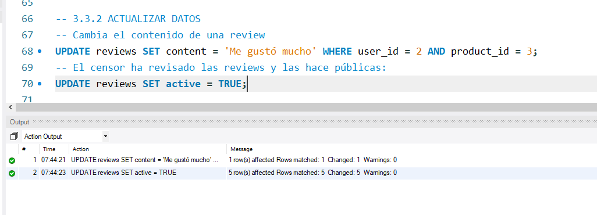

# boot202-sql-rels

Exercise: Create Database and Relationships

https://classroom.google.com/u/0/c/NDgwNDYwMTI2OTAz/a/NTE0OTI2NTkxNjU0/details

## 2. Create and use DB

### 2.1. Create schema

* Users, Products, Orders and Categories
* Needed a Details table for the many to many relationship between Products and
Orders

### 2.2. Execute queries

#### 2.2.1. Insert data
* new users

* new categories (order changed because we need to insert categories **before**
products)

* new products

* new orders (inserted orders **and** details)

#### 2.2.2. Update data
* change name of one product by id

* change price of one product (we update the product **and** the details with
that product)

#### 2.2.3. Get data

## 3. Extra

### 3.1. Delete data
* Trying to delete a product will trigger an constraint error, because that
product is referenced as FK in the table `details`.

* We need to delete the referencing line **before** deleting the product.

### 3.2. Update schema
* Add new table `reviews`.

### 3.3. Execute queries
* Add new reviews.

#### 3.3.1. Insert data

#### 3.3.2. Update data

#### 3.3.3. Get data
* Get all reviews

* Get all products, with their reviews

We understand that **all products** implies a `LEFT JOIN`.

* Another example, with average ratings.

* Get a product with its reviews

* Get products with category and reviews

We choose, again, a `LEFT JOIN`.

* A user and their orders with details

#### 3.3.4. Delete data

* Delete a review by `id`.
In this BD, the reviews have no `id`. They are referenced as PK by the
combination `(user_id,product_id)`.

But it's easy to add an `id` (the exercise never says that it **must be** a PK).

And then, use the `id` to delete a review.

